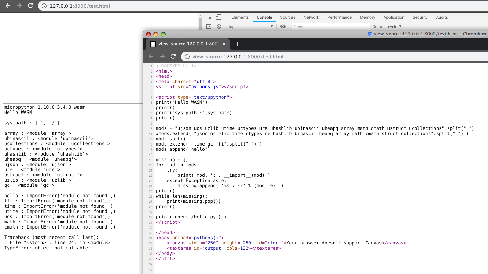

# MicroPython and Web Assembly (wasm)


## What ?

wasm is a virtual machine for internet browsers which run bytecode closer to native speeds
see https://webassembly.org/

but we want to run python virtual machine and its own bytecode ;) so thanks to micropython
we'll be able to by compiling micropython core to wasm bytecode first.


## Requirements

 - Linux OS with gcc/clang, a decent build environnement and libltdl-dev

 - have python3 in your path 3.6 should do it but 3.7 / 3.8 are safer.

 - Follow the instructions for getting started with Emscripten [here](http://kripken.github.io/emscripten-site/docs/getting_started/downloads.html).


## Getting started

Beware this is not a micropython fork :
 it's a port folder to add support to official micropython for a new "machine"


You first need to get easy building your own official micropython and its javascript port


Follow the instructions for getting started with micropython unix build

https://github.com/micropython/micropython/


to check if your emscripten build works ( facultative, FYI last test on emscripten 1.38.31 was ok )

https://github.com/micropython/micropython/tree/master/ports/javascript

but i suggest using ```emmake make -C ports/javascript PYTHON=python2``` instead of just make


What are the differences between this repo and the official javascript port?

see https://github.com/pmp-p/micropython-ports-wasm/issues/4


## Dive in !

now you're ready to build the port, you can run

```
# micropython-ports-wasm will go in micropython/ports/wasm
# as it's not a fork but a drop in target port we need to checkout a full microPython

# get the micropython core.

# official ( should always work ! )
git clone --recursive --recurse-submodules https://github.com/micropython/micropython
cd micropython


# or lvgl enabled ( wip could not work )
# git clone --recursive --recurse-submodules https://github.com/littlevgl/lv_micropython.git
# cd lv_micropython
# git checkout dev-6.0
# git submodule update --recursive --init


#build host tools
make -C mpy-cross
make -C ports/unix

#add the target port
cd micropython/ports
git clone https://github.com/pmp-p/micropython-ports-wasm.git wasm


cd wasm

#transpile the mixed python/C module to pure C
#use a python3 version with annotations support !
. modgen.sh


. /path/to/emsdk/emsdk_set_env.sh

#for LVGL support use "emmake make LVGL=1 && . runtest.sh" instead
emmake make && . runtest.sh


```

now you can navigate http://127.0.0.1:8000/index.html

to edit code samples look in micropython/*.html


## Usage


copy the 4 files located in micropython folder found inside the build folder
 ``pythons.js micropython.js micropython.data micropython.wasm``
and drop them where your main let's say myupython.html file will be

now you have 3 options to run code :

 1) from the web via arguments ( sys.argv ) with a call myupython.html?full_url_to_the_script.py

 2) from a <script type="text/µpython> tag

 3) interactively from repl with xterm.js


for 1&2 you will need to provide a javascript term_impl(text) function that output stdout stream where you want it to go





meet me on  #microPython or #micropython-fr on freenode

https://kiwi.freenode.net/?nick=upy-wasm-guest&channel=#micropython-fr


## History:

codebase
https://github.com/matthewelse/micropython

Micropython webassembly target
https://github.com/micropython/micropython/issues/3313

Support for Emscripten
https://github.com/micropython/micropython/pull/2618

RFC: emscripten: Got something to compile and link.
https://github.com/micropython/micropython/pull/1561

Javascript Port - MicroPython transmuted into Javascript by Emscripten.
https://github.com/micropython/micropython/pull/3575

Emscripten

https://github.com/micropython/micropython/issues/888


MicroPython and emscripten

https://www.bountysource.com/issues/5037165-emscripten

https://github.com/micropython/micropython/issues/3474

https://github.com/kkimdev/epsilon

